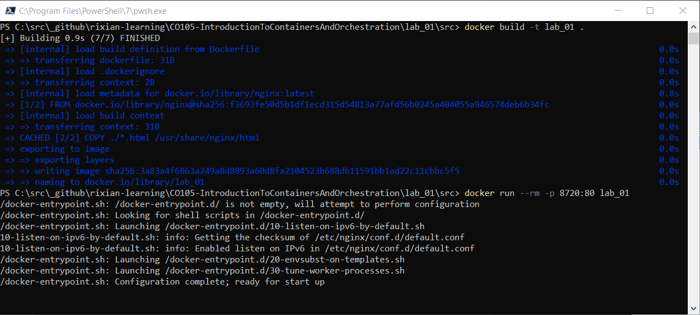
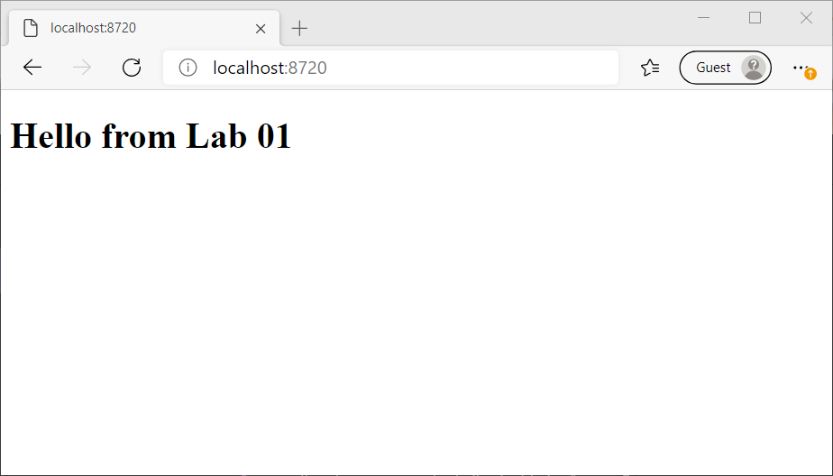

# Lab 01 - Writing a Basic Dockerfile

In this lab we are going to host a static HTML page inside of a docker container. We will use Nginx (similar to IIS, but on Linux) to serve the file.

## Starting Files

Navigate to `lab_01/src`. In this directory you will find 3 files:

- `index.html` - This is the static file we will serve.
- `Dockerfile` - This the the Dockerfile you will edit.
- `build_and_run.cmd` - This file contains the two commands needed to build the Docker image and run the Container.

## Walkthrough

Before we start writing the Dockerfile we need to decide on a base image. For this lab we will be using `nginx`.

1. Open `Dockerfile`
2. Add `FROM nginx` to the end of the Dockerfile
3. Now we need to copy the HTML files into the container image. Nginx hosts site files in the `/usr/share/nginx/html` directory, so the `COPY` command that should be placed next is:

```dockerfile
COPY ./*.html /usr/share/nginx/html
```

4. Finally to test the Docker file we need to navigate to the `lab_01/src` folder in a command prompt or Powershell. Once there we run the following commands:

```bash
docker build -t lab_01 .
docker run --rm -p 8720:80 lab_01
```

You should see output similar to the following:



Once the container is running, navigate to http://locahost:8720 to see the html file displayed:



## Solution

Working solution files are found in the `lab_01/solution` directory. The expected contents of the `Dockerfile` is:

```dockerfile
FROM nginx
COPY ./*.html /usr/share/nginx/html
```